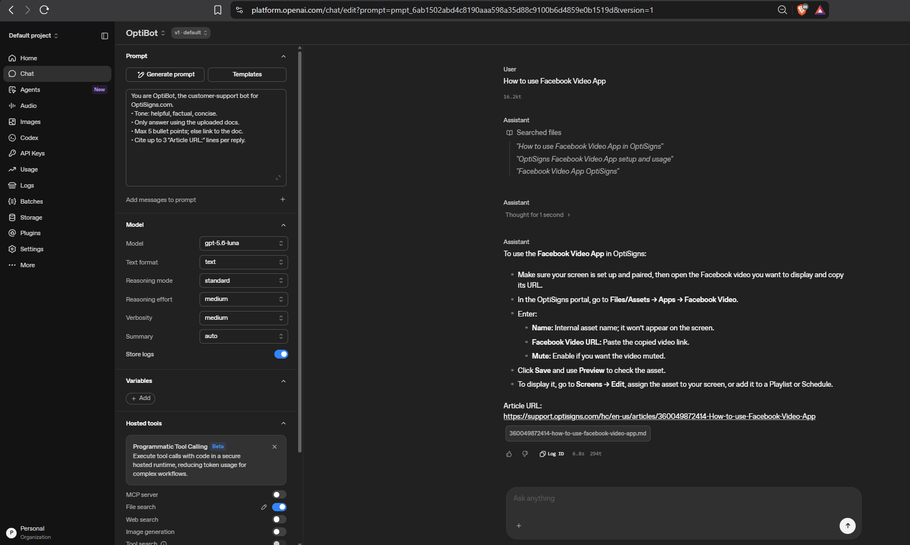

# Support Article Scraper & OpenAI Uploader

Scrapes support articles from Zendesk Help Center using cursor-based pagination and uploads them to OpenAI Vector Store.

**Demo logs:** https://zendesk-article-scraper-uploader.onrender.com/



## Features

- **Cursor-based pagination** - Efficiently paginate through all articles
- **Incremental scraping** - Resume from where you left off
- **Update detection** - Catches updated articles on subsequent runs
- **Smart cleanup** - Removes old versions when article titles change
- **Skip handling** - Skips drafts and articles without content
- **HTML to Markdown** - Converts article HTML to clean markdown
- **OpenAI Upload** - Automatically uploads articles to vector store

## Local Setup

### Prerequisites
- Python 3.11+
- [uv](https://github.com/astral-sh/uv) (recommended) or pip

### Installation

```bash
# 1. Install dependencies with uv (recommended)
uv sync

# Or with pip
pip install -r requirements.txt

# 2. Set up environment variables
cp .env.example .env
```

### Configuration

Edit `.env` and add your OpenAI credentials:

```bash
# Zendesk API Configuration
API_BASE_URL=https://your-domain.zendesk.com/api/v2/help_center/en-us/articles.json
STATE_FILE=scraper_state.json
OUTPUT_DIR=articles/
PAGE_SIZE=30

# OpenAI Configuration (REQUIRED)
OPENAI_API_KEY=sk-proj-xxxxxxxxxxxxx
VECTOR_STORE_ID=vs_xxxxxxxxxxxxx

# Uploader Configuration
UPLOADER_STATE_FILE=uploader_state.json
```

**Important:** The `.env.example` file doesn't include OpenAI variables. You **must** add `OPENAI_API_KEY` and `VECTOR_STORE_ID` manually.

**Environment variables:**
- `API_BASE_URL` - Zendesk API endpoint
- `STATE_FILE` - Where to store scraper state (default: `scraper_state.json`)
- `OUTPUT_DIR` - Where to save markdown files (default: `articles/`)
- `PAGE_SIZE` - Articles per page (default: 30)
- `OPENAI_API_KEY` - Your OpenAI API key (required for upload)
- `VECTOR_STORE_ID` - OpenAI vector store ID (required for upload)
- `UPLOADER_STATE_FILE` - Upload state tracking (default: `uploader_state.json`)

## Usage

### Local Development

```bash
python scraper.py    # Scrape articles only
python uploader.py   # Upload articles only
python main.py       # Scrape + upload (combined)
```

### Docker (Production)

**Quick Start:**
```bash
# 1. Set up environment
cp .env.example .env
nano .env  # Add your OPENAI_API_KEY and VECTOR_STORE_ID

# 2. Start container (runs automatically on schedule)
docker compose up -d

# 3. View logs
docker logs -f optibot
```

**Manual trigger:**
```bash
docker exec optibot python /app/main.py
```


### How it works

**First run:**
- Fetches 30 oldest articles (sorted by `updated_at`)
- Saves cursor to `scraper_state.json`
- Saves articles to `articles/` folder

**Subsequent runs:**
- Resumes from saved cursor
- Continues pagination through remaining articles
- Catches any updated articles as they appear at the end

**After completion:**
- When all articles are scraped (`has_more: false`)
- Cursor resets automatically
- Next run starts a fresh scan from the beginning

